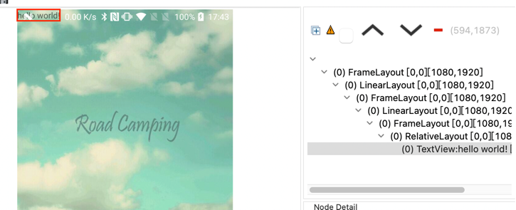
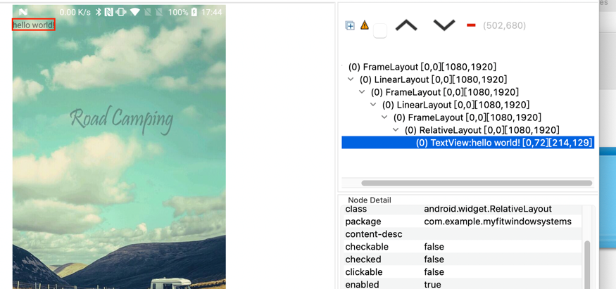

# SystemUiTraining


```
<?xml version="1.0" encoding="utf-8"?>
<RelativeLayout
    xmlns:android="http://schemas.android.com/apk/res/android"
    xmlns:tools="http://schemas.android.com/tools"
    android:layout_width="match_parent"
    android:layout_height="match_parent"
    android:background="@drawable/image"

    tools:context="com.example.myfitwindowsystems.ImageActivity">

<!--    fitsSystemWindows  默认 =  false 
 当  android:fitsSystemWindows="false" 时，"hello world!"会合状态栏重叠。
 当 android:fitsSystemWindows="true"时，"hello world!"不会合状态栏重叠。
 
 -->
    <TextView
        android:layout_width="wrap_content"
        android:layout_height="wrap_content"
        android:text="hello world!" />
</RelativeLayout>

```
android:fitsSystemWindows="false"
结果



android:fitsSystemWindows="true"
结果

